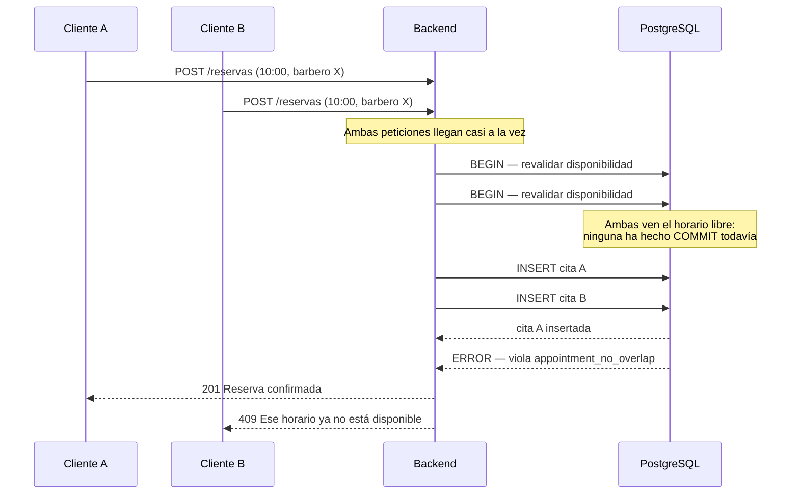

# ADR-003 — Restricción `EXCLUDE` de PostgreSQL contra doble reserva

**Estado:** Aceptado
**Fecha:** Agosto 2026

> Esta es la decisión técnica más importante del proyecto.

## Contexto

Dos clientes pueden abrir la página pública al mismo tiempo, ver el mismo horario libre y confirmar con milisegundos de diferencia. El sistema debe garantizar que **nunca** queden dos citas cruzadas para el mismo barbero.

El costo de fallar no es un error en pantalla: son dos personas presentándose a la misma hora, un barbero que no puede atender a ambas, y la barbería quedando mal frente a sus clientes. Es el peor fallo posible del producto.

Además, las citas no ocupan bloques de tamaño fijo: un corte dura 30 minutos y un tinturado 120. El conflicto es entre **rangos de tiempo solapados**, no entre valores iguales.

## Decisión

La garantía la da **la base de datos**, mediante una restricción `EXCLUDE` sobre rangos de tiempo con la extensión `btree_gist`:

```sql
CREATE EXTENSION IF NOT EXISTS btree_gist;

ALTER TABLE appointment ADD CONSTRAINT appointment_no_overlap
  EXCLUDE USING gist (
    staff_id WITH =,
    tstzrange(
      scheduled_at,
      scheduled_at + (duration_min || ' minutes')::interval
    ) WITH &&
  ) WHERE (status IN ('PENDING', 'CONFIRMED'));
```

Se lee: *no pueden existir dos filas con el mismo `staff_id` cuyos rangos de tiempo se solapen, considerando solo citas pendientes o confirmadas.*

La cláusula `WHERE` es esencial: una cita cancelada o marcada como no asistida **libera** el horario y no debe bloquear una reserva nueva.

**La aplicación también valida**, dentro de la misma transacción, antes de insertar. Eso permite responder "ese horario ya no está disponible" con un mensaje claro en la mayoría de los casos. Pero la validación en código es para la experiencia de usuario; **la restricción es la que garantiza la corrección.**



El diagrama muestra por qué la validación en código **no basta**: ambas transacciones ven el horario libre porque ninguna ha confirmado aún. Solo la restricción resuelve el empate.

## Alternativas consideradas

| Alternativa | Por qué se descartó |
|---|---|
| **Solo validar en código de aplicación** | Existe una ventana de carrera entre la consulta y la inserción. Falla poco, pero falla — y justo cuando hay más tráfico |
| **`SELECT ... FOR UPDATE` sobre el barbero** | Funciona, pero serializa todas las reservas de ese barbero, complica el código y hay que acordarse de aplicarlo en cada ruta que inserte citas |
| **Bloqueo optimista con campo de versión** | No aplica: el conflicto es entre filas distintas que aún no existen, no sobre una misma fila |
| **Índice único sobre (staff_id, scheduled_at)** | Solo detecta horas de inicio idénticas. Una cita de 10:00 a 11:30 y otra de 10:30 a 11:00 pasarían sin problema |
| **Bloqueo distribuido con Redis** | Agrega una dependencia de infraestructura para resolver algo que Postgres ya hace, y con menos garantías |

## Consecuencias

**Ganamos**
- Garantía real, no probabilística. No hay forma de insertar un solapamiento, ni siquiera por error de programación en una ruta nueva
- La protección aplica a **todas** las vías de creación de citas: página pública, dashboard, reprogramación, o un script manual
- Cero código de sincronización que mantener

**Aceptamos**
- **Acoplamiento a PostgreSQL.** Migrar a otro motor exigiría rediseñar esta pieza. Se asume conscientemente: no hay plan de migrar
- La violación de la restricción llega como una excepción de base de datos y **hay que traducirla** a un error entendible. Sin esa traducción, el cliente ve un error 500 genérico (ticket GUA-43)
- Modificar el `duration_min` o el `status` de una cita puede disparar la restricción; las transiciones de estado deben contemplarlo
- Los tests **deben** incluir un caso concurrente real. Un test secuencial no prueba nada aquí

## Verificación

Existe un test obligatorio en CI que lanza dos inserciones concurrentes del mismo horario y verifica que exactamente una sobrevive. **Si alguien elimina la restricción, ese test se pone en rojo y el PR no se puede mergear.**
