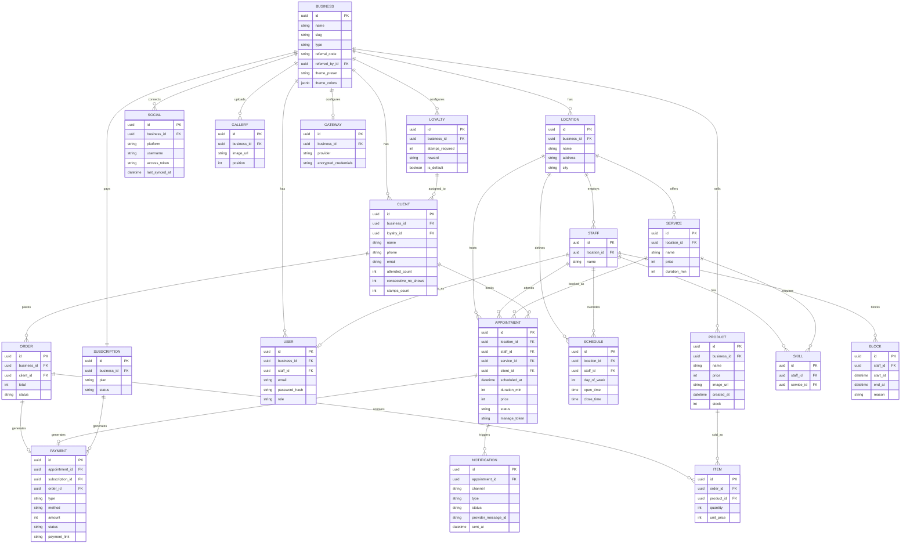

# Guardao — Plan de proyecto (módulo de barberías)

## 1. Qué es Guardao

Guardao es una plataforma de reservas para negocios en Colombia, con pagos integrados. El plan cubre tres mercados — **barberías**, **discotecas** y **restaurantes** — pero el desarrollo arranca únicamente con el módulo de barberías. Cuando esté funcionando y validado, se expande a los otros dos verticales reutilizando la misma base técnica y el mismo motor de reservas.

El proyecto y el dominio propio van con el nombre **Guardao** — entre `guardao.com` y `guardao.co`, aún por definir según precio y el público al que apuntan (`barberia.lat`, visto en las capturas iniciales, era solo el nombre de un competidor tomado como referencia de diseño y funcionalidades, no la marca propia).

Cada barbería paga una **suscripción mensual a Guardao** para usar la plataforma. Aparte, cada barbería cobra directamente a sus propios clientes por sus servicios — Guardao no toca ese dinero (modelo de pasarela de pago propia por negocio).

No incluye ningún chatbot ni asistente de IA — se descartó explícitamente la sección "Luna IA" que aparecía en los mockups iniciales.

## 2. Tecnologías

| Capa | Tecnología |
|---|---|
| Frontend | Next.js (React) |
| Backend | Spring Boot (Java) — API REST |
| Base de datos | PostgreSQL |
| ORM / migraciones | Spring Data JPA + Hibernate, Flyway |
| Autenticación | Spring Security + JWT |
| Documentación de API | springdoc-openapi (OpenAPI 3 + Swagger UI) |
| Infraestructura | VPS (Hetzner o DigitalOcean) + Coolify |
| Contenedores | Docker (incluido en Coolify) + Docker Compose para levantar Postgres en desarrollo local |
| Pasarela de pagos | Wompi, con patrón adaptador para sumar otras después (ej. PayU) |
| Notificaciones | WhatsApp Business API (Meta Cloud API o Twilio) + correo (ej. Resend) como respaldo |
| Redes sociales | Instagram Display API, TikTok Display API |
| Almacenamiento de archivos | Cloudflare R2 o DigitalOcean Spaces (S3-compatible) |

## 3. Funcionalidades

**Cuentas y estructura**
- Registro/login del dueño de barbería, con soporte de múltiples sedes por cuenta
- Roles: dueño (`OWNER`), barbero (`STAFF`, con usuario propio vinculado a su registro de staff) y super-admin interno de Guardao (`SUPER_ADMIN`)

**Agenda**
- Vista de citas por día, semana y mes; creación manual de citas
- Solo el barbero asignado (validado contra su usuario autenticado) puede marcar una cita como finalizada/asistida
- Estados: pendiente, confirmada, completada, cancelada, no asistió
- Al crear o reprogramar una cita, el backend revalida la disponibilidad dentro de la misma transacción antes de confirmar — nunca confía solo en lo que el cliente vio previamente en pantalla; la restricción de base de datos queda como respaldo final ante cualquier caso límite
- Cada cita guarda su propia copia del precio y la duración del servicio al momento de reservar, para que un cambio de precio futuro no altere citas ya realizadas

**Staff y servicios**
- CRUD de barberos y de servicios (nombre, precio, duración en incrementos de 30 minutos — un corte no dura lo mismo que un tinturado) por sede
- Habilidades: qué barbero sabe hacer qué servicio; al reservar, solo se muestra el staff capacitado para el servicio elegido
- Horario general de atención por sede, con múltiples franjas por día (ej. sábado con jornada partida)
- Cada barbero puede tener además su propio horario dentro del horario general de la sede, más días libres, vacaciones y bloqueos puntuales de agenda

**Página pública de reservas**
- Un link por barbería (`guardao.com/book/:slug`, dominio final por confirmar), con selector de sede si tiene más de una
- El cliente elige servicio → ve solo el staff capacitado para ese servicio → elige horario disponible
- Calendario de horarios disponibles — los horarios ya ocupados se muestran deshabilitados (no ocultos), para que el cliente vea el día completo de un vistazo
- Formulario pide nombre, teléfono y correo
- Reconoce clientes recurrentes por número de teléfono (no hay login de cliente)
- Catálogo de productos con imagen: muestra ~10 productos (los más comprados; si aún no hay historial de compras, los más recientes) con opción de "ver más" para el catálogo completo, con búsqueda y filtro
- Carrito de compras: el cliente puede agregar varios productos con cantidad y pagar en línea directo desde la página (checkout contra Wompi, independiente del flujo de cobro de citas)
- Galería de fotos/videos: se alimenta automáticamente desde Instagram y/o TikTok si están conectados, y también admite fotos subidas manualmente por el negocio — útil para quien no tiene redes conectadas, o quiere complementar

**Personalización visual de la página pública**
- Cada barbería elige desde su dashboard los colores con los que sus clientes ven la página de reservas
- 5 paletas predefinidas, más una opción "personalizada" donde puede ajustar cada color a mano
- La personalización es solo de colores: no incluye fuentes, tamaños ni disposición de la página
- Aplica únicamente a la página pública; el dashboard mantiene siempre su paleta oscura

**Cancelación y reprogramación del cliente**
- Sin necesidad de crear cuenta: el cliente recibe un enlace privado (token único por cita) donde puede ver, cancelar o reprogramar su reserva
- Reprogramar pasa por la misma validación de disponibilidad que una reserva nueva

**Notificaciones**
- Confirmación de reserva, recordatorio antes de la cita, cancelación, reprogramación y confirmación de pago recibido
- Enviadas por WhatsApp (canal principal en Colombia) y/o correo como respaldo
- Ayuda directamente a reducir las inasistencias

**Pagos**
- Cada barbería conecta su propia cuenta Wompi — el dinero de sus clientes va directo a ellos
- Adelanto configurable al reservar
- En la cita, el barbero elige si el cliente paga en efectivo o por transferencia; si es transferencia, se genera un QR en pantalla para que el cliente lo escanee ahí mismo
- Suscripción mensual de la barbería a Guardao, cobro recurrente automático vía tokenización — este pago sí llega a la cuenta de Guardao
- Arquitectura con patrón adaptador para sumar otras pasarelas sin rediseñar el sistema

**Lealtad**
- Programa de sellos configurable (cuántos sellos, cuál es el premio)
- Un negocio puede tener varias tarjetas distintas a lo largo del tiempo; la más nueva marcada como predeterminada se asigna automáticamente a clientes nuevos, sin tocar a los que ya tenían tarjeta asignada
- El barbero puede reasignar manualmente la tarjeta de un cliente desde su perfil
- Cada cliente tiene una sola tarjeta activa a la vez

**Asistencia**
- Contador de citas asistidas y de inasistencias
- Si un cliente acumula 3 inasistencias seguidas, el sistema exige adelanto obligatorio para poder reservar de nuevo

**Referidos**
- Código de referido único por barbería
- Gana un monto fijo por cada barbería referida que se registre y pague, más el 10% de los pagos de suscripción siguientes de esa barbería

**Panel admin interno (Guardao)**
- Ver cuántas barberías están activas en la plataforma, estado de sus suscripciones, métricas generales

## 4. Modelo de datos



### Tema visual de la página pública

`BUSINESS.theme_preset` y `BUSINESS.theme_colors` guardan la personalización de colores de la página de reservas.

Las 5 paletas predefinidas **viven en código**, como constantes compartidas entre backend y frontend — no en base de datos. El negocio solo guarda cuál eligió, así que afinar una paleta más adelante es cambiar una constante, sin migración ni script de actualización.

`theme_colors` es nulo salvo cuando `theme_preset = 'custom'`, y entonces contiene los 5 tokens de color elegidos a mano. Se usa `jsonb` en vez de cinco columnas para poder sumar un sexto token después sin migrar la tabla.

Los tokens son semánticos, no colores sueltos, para que ninguna combinación deje la página ilegible:

| Token | Para qué |
|---|---|
| `primary` | Botones de acción, horario seleccionado |
| `primary_foreground` | Texto sobre el color primario |
| `background` | Fondo de la página |
| `surface` | Tarjetas, calendario, formulario |
| `foreground` | Texto principal |

El resto de colores (bordes, texto secundario, estado deshabilitado) se derivan por opacidad de esos cinco.

El tema vive en `BUSINESS` y no en `LOCATION` porque la marca es del negocio: una barbería con tres sedes sigue siendo una sola página con selector de sede, no tres identidades visuales.

---

`SCHEDULE.staff_id` es opcional: nulo significa horario general de la sede, con valor significa el horario específico de ese barbero. `BLOCK` cubre lo puntual (vacaciones, un bloqueo de una tarde) que no encaja en un horario recurrente semanal. `USER.staff_id` solo se llena cuando `role = STAFF`, y es lo que conecta a un barbero con su propio inicio de sesión. `PRODUCT.stock` es opcional: nulo significa que el negocio no controla inventario (stock ilimitado); con un número, el checkout lo valida y lo descuenta.

## 5. Roadmap, en 4 frentes escalonados

El proyecto avanza en cuatro frentes: **Backend**, **Frontend**, **Testing** y **Deploy**. Las etapas están numeradas para que Backend, Frontend y Testing se correspondan entre sí — la etapa *N* de cada frente trabaja sobre lo mismo que construyen las otras dos en esa etapa. Deploy corre por su cuenta: su etapa 0 (infraestructura) va primero en el tiempo, y sus etapas siguientes acompañan cada entrega en paralelo, sin numeración compartida con las otras tres.

| Etapa | Backend | Frontend | Testing |
|---|---|---|---|
| 0 | Setup del proyecto | Setup del proyecto | Entorno de pruebas y migraciones |
| 1 | Cuentas, autenticación y rol STAFF | Registro y login | Auth, aislamiento multi-tenant y seguridad básica |
| 2 | Staff, servicios, habilidades y horarios individuales | Configuración (sedes, staff, servicios, horarios, bloqueos) | Disponibilidad, CRUD de staff/servicios/habilidades |
| 3 | Agenda / citas | Agenda (dashboard) | Motor de reservas: solapamientos, doble reserva, estados |
| 4 | Página pública, cancelación/reprogramación | Página pública de reservas | E2E de reserva pública, seguridad del enlace, frontend |
| 5 | Pagos (Wompi) | Pagos (UI) | Webhooks, idempotencia, pagos contra sandbox |
| — | *Notificaciones (transversal a las etapas 3-5)* | | *Envío por evento y webhook de respuestas* |
| — | **Fin del MVP — hasta aquí es lanzable** | | |
| 6 | Lealtad | Lealtad | Sellos, tarjeta predeterminada, reasignación |
| 7 | Catálogo y redes sociales | Catálogo y redes sociales | Subida de imagen, OAuth mockeado |
| 8 | Referidos | Referidos | Cálculo de comisión |
| 9 | Panel admin interno | Panel admin interno | Acceso exclusivo, métricas |

---

## 5.1 Backend (Spring Boot)

### Etapa 0 — Setup del proyecto
- Crear proyecto Spring Boot (Web, JPA, Security, Validation, driver de PostgreSQL)
- Configurar conexión a PostgreSQL con perfiles (local, staging, producción)
- Configurar Flyway y escribir la migración inicial con las 17 tablas del esquema, incluyendo desde ya las columnas `theme_preset` y `theme_colors` de `BUSINESS` (el tema se implementa en la Etapa 4, pero dejarlas aquí evita una migración extra sobre una tabla ya en producción)
- Configurar Spring Security base: generación y validación de JWT, filtro de autenticación
- Configurar CORS para permitir el dominio del frontend
- Manejo global de errores (`@ControllerAdvice`) con formato de respuesta consistente
- Configurar logging y variables de entorno por perfil
- Agregar `springdoc-openapi` (Swagger UI + spec OpenAPI 3, con el esquema de seguridad JWT documentado)

### Etapa 1 — Cuentas, autenticación y rol STAFF
- Entidades `Business`, `Location`, `User` + repositorios JPA
- Endpoint de registro de barbería (crea `Business` + `Location` inicial + `User` con rol `OWNER`)
- Endpoint de login (devuelve JWT) y de refresh token
- Middleware que resuelve el `business_id` del usuario autenticado y lo aplica a cada consulta (aislamiento multi-tenant)
- Endpoint para que el `OWNER` cree usuarios `STAFF` vinculados a un barbero existente (`User.staff_id`)
- Mecanismo para crear usuarios `SUPER_ADMIN` (solo vía script/seed, nunca público)
- CRUD de sedes (`Location`): crear, editar, listar, eliminar

### Etapa 2 — Staff, servicios, habilidades y horarios individuales
- Entidades `Staff`, `Service`, `Skill`
- CRUD de staff por sede
- CRUD de servicios por sede (con duración en pasos de 30 minutos)
- Endpoint para asignar/quitar habilidades entre staff y servicios
- Entidad y CRUD de `Schedule` (horario general de sede, y horario específico opcional por barbero)
- Entidad y CRUD de `Block` (días libres, vacaciones, bloqueos puntuales por barbero)
- Endpoint de disponibilidad: cruza `Schedule` (general y específico), `Block` y `Appointment` ya ocupadas para un rango de fechas, calculando los huecos según la duración propia del servicio elegido (no un tamaño de turno fijo)

### Etapa 3 — Agenda / citas
- Entidad `Client`, con lógica de "buscar o crear" por teléfono + `business_id`
- Entidad `Appointment`
- Restricción `EXCLUDE` por rango de tiempo en PostgreSQL (extensión `btree_gist`) sobre `Appointment`: impide que el mismo `staff_id` tenga dos citas con horarios que se crucen, incluso si dos reservas llegan al mismo tiempo desde lugares distintos
- Manejo de la violación de esa restricción en Spring Boot: responde con un error claro ("ese horario ya no está disponible") en vez de un error genérico de base de datos
- Endpoint para crear cita manualmente desde el dashboard, revalidando disponibilidad dentro de la misma transacción antes de insertar
- Al crear la cita, copiar `price` y `duration_min` del servicio hacia la propia `Appointment` (snapshot histórico)
- Endpoint para listar citas por día/semana/mes, filtradas por sede
- Endpoint para cambiar estado de una cita, validando que solo el usuario `STAFF` vinculado al `staff_id` asignado puede marcarla `COMPLETED`
- Lógica de negocio: al completar, sube `attended_count` y se resetea `consecutive_no_shows`; al marcar `NO_SHOW`, sube `consecutive_no_shows`
- Endpoints de informes básicos (totales, completadas, ingresos por barbero)

### Etapa 4 — Página pública, cancelación y reprogramación
- Endpoint público: datos de la barbería por slug
- Endpoint público: servicios disponibles con staff filtrado por `Skill` según el servicio elegido
- Endpoint público: horarios disponibles según sede/staff/fecha
- Endpoint público: crear reserva — busca o crea `Client` por teléfono, valida si `consecutive_no_shows >= 3` para exigir adelanto, crea la `Appointment` con su `manage_token` único
- Endpoint público (por token): ver el detalle de una cita, cancelarla o reprogramarla — sin necesidad de login del cliente
- Reprogramar revalida disponibilidad igual que una reserva nueva
- Rate limiting básico en los endpoints públicos
- Definir las 5 paletas predefinidas como constantes compartidas, y el endpoint para que el negocio guarde su tema (preset elegido o los 5 colores personalizados)
- Validación estricta del formato `#RRGGBB` en los colores personalizados: el valor termina dentro de una etiqueta `<style>` de la página pública, así que sin validar sería una vía de inyección de CSS
- Incluir el tema resuelto en la respuesta del endpoint público de datos de la barbería (no es un endpoint nuevo)

### Notificaciones (transversal, se integra en las etapas 3 a 5)
- Entidad `Notification` (canal, tipo, estado, fecha de envío) para trazabilidad
- Integración con WhatsApp Business API (Meta Cloud API o Twilio) y con correo como respaldo — **una sola cuenta de Guardao**, compartida por todas las barberías (no cada una conecta la suya, a diferencia de Wompi); plantillas de mensaje aprobadas una vez ante Meta, con variables por cita
- Disparadores por evento: confirmación al reservar, cancelación, reprogramación, pago recibido
- Job programado (`@Scheduled`) que envía el recordatorio antes de cada cita
- Manejo de fallos de envío sin bloquear el flujo principal (la reserva se confirma aunque el mensaje falle; se reintenta aparte)
- Webhook de mensajes entrantes: si el cliente responde a una notificación, se usa el ID del mensaje original (guardado en `Notification.provider_message_id`) para identificar la cita y contestar automáticamente con su enlace de gestión — sin interpretar el texto ni lógica de bot, siempre la misma respuesta fija

### Etapa 5 — Pagos (Wompi)
- Interfaz `PaymentGatewayAdapter` (crear transacción, verificar webhook, consultar estado)
- Implementación `WompiAdapter`
- Entidad `Gateway`, endpoint para que cada negocio conecte sus credenciales (cifradas en reposo)
- Endpoint para generar cobro (adelanto o servicio), soportando efectivo o transferencia con QR
- Webhook receptor de Wompi, validación de firma, actualización de `Payment.status`
- Lógica de suscripción: cobro recurrente mensual por tokenización hacia la cuenta de Guardao, disparado por job programado
- Manejo de pagos fallidos y reintentos de suscripción

### Etapa 6 — Lealtad
- Entidad `Loyalty`
- Endpoints para crear/editar tarjetas y marcar una como predeterminada
- Lógica: cliente nuevo se asigna automáticamente a la tarjeta predeterminada vigente
- Endpoint para reasignar manualmente la tarjeta de un cliente
- Lógica: sumar sello automáticamente al completar una cita, detectar cuando se alcanza el premio

### Etapa 7 — Catálogo y redes sociales
- Entidad `Product`, CRUD con subida de imagen a almacenamiento S3-compatible
- Entidad `Social`, flujo OAuth para conectar Instagram
- Flujo OAuth para conectar TikTok
- Job programado que sincroniza periódicamente fotos/videos de las cuentas conectadas
- Entidad `Gallery`, CRUD para subir/eliminar/ordenar fotos manuales del negocio (independiente de si tiene redes conectadas)
- Endpoint público que combina galería sincronizada + fotos manuales para la página de reservas
- Endpoint público de catálogo: top ~10 productos (por cantidad vendida vía `Item`, o por `Product.created_at` si aún no hay ventas), con paginación para "ver más", búsqueda por nombre y filtro
- Entidades `Order` e `Item`, endpoint de checkout del carrito: crea el pedido con sus líneas (cantidad y precio unitario copiado del producto), genera el cobro contra Wompi usando el mismo `PaymentGatewayAdapter` de la Etapa 5, y actualiza el estado vía webhook
- Restricción `CHECK (stock >= 0)` en PostgreSQL sobre `Product`: el descuento de stock ocurre dentro de la misma transacción del checkout, y esa restricción rechaza cualquier compra que deje el stock en negativo aunque dos compras del último producto lleguen al mismo tiempo — mismo principio que la protección contra doble reserva de citas

### Etapa 8 — Referidos
- Lógica para capturar `referred_by_id` al registrar una barbería con un código de referido
- Endpoint para consultar el código propio y calcular el total ganado (10% de pagos de suscripción de referidos)

### Etapa 9 — Panel admin interno
- Endpoints exclusivos para `SUPER_ADMIN`: listado de negocios activos, estado de suscripción, métricas agregadas (MRR, churn, altas por mes)
- Endpoint de monitoreo de notificaciones: tasa de envío/fallo por canal y tipo, usando la propia entidad `Notification` — no incluye gestión de plantillas (eso se maneja directamente en Meta Business Manager / WhatsApp Manager, no dentro de Guardao)

---

## 5.2 Frontend (Next.js)

### Etapa 0 — Setup del proyecto
- Crear proyecto Next.js (App Router) + Tailwind + shadcn/ui, replicando la paleta oscura ya diseñada
- Cliente HTTP centralizado con manejo de JWT (guardar token, adjuntarlo en cada request, refresh)
- Layout base del dashboard (sidebar sin Luna IA ni Conversaciones) y layout de la página pública
- Rutas protegidas (dashboard) vs. públicas (booking)

### Etapa 1 — Registro y login
- Pantalla de registro de barbería
- Pantalla de login, compartida entre `OWNER` y `STAFF` (la vista del dashboard cambia según el rol)
- Manejo de sesión: persistencia del JWT, logout, redirecciones

### Etapa 2 — Configuración
- CRUD de sedes en el panel de Config, selector de sede activa si hay varias
- CRUD de staff, con opción de crear su usuario de acceso (`STAFF`)
- CRUD de servicios y precios, con selector de duración en pasos de 30 minutos
- UI para asignar habilidades (qué staff hace qué servicio)
- Formulario de horario general por sede, con soporte de múltiples franjas
- Formulario de horario individual por barbero, y de días libres/vacaciones/bloqueos puntuales

### Etapa 3 — Agenda (dashboard de citas)
- Vista día/semana/mes, migrada a Next.js y conectada a la API real
- Modal de "nueva cita"
- Acciones sobre una cita: completar (solo visible/habilitado para el barbero asignado si es `STAFF`), cancelar, marcar no asistió
- Indicador de estado de las notificaciones enviadas por cita (confirmación, recordatorio, etc.)
- Página de informes conectada a los endpoints reales

### Etapa 4 — Página pública, cancelación y reprogramación
- Selector de sede (si aplica)
- Selector de servicio, que filtra el staff automáticamente
- Calendario de horarios disponibles — los horarios ya ocupados se muestran deshabilitados (no ocultos)
- Formulario de datos del cliente (nombre, teléfono, correo)
- Aviso de "requiere adelanto" cuando aplica la regla de 3 inasistencias
- Sección de catálogo de productos con imagen
- Galería de fotos/videos (Instagram/TikTok)
- Pantalla de gestión de cita vía enlace privado: ver, cancelar o reprogramar sin login
- Construir toda la página pública sobre tokens de color (variables CSS), nunca con colores fijos — el layout público inyecta las variables desde el servidor, así que no hay parpadeo de color al cargar
- Pantalla de configuración del tema: las 5 paletas como tarjetas de vista previa, selector de color por token cuando elige "personalizada", y previsualización en vivo de la página
- Advertencia de contraste insuficiente cuando una combinación personalizada deja el texto difícil de leer — es un aviso, no un bloqueo: es su marca

### Etapa 5 — Pagos
- Panel para conectar la cuenta Wompi del negocio
- Configuración del adelanto (activar/desactivar, monto)
- En la vista de una cita: acción de "cobrar" con opción efectivo o transferencia, mostrando el QR en pantalla cuando aplica
- Estado del pago reflejado en la cita (tiempo real o polling)
- Pantalla de estado de la suscripción de la barbería a Guardao

### Etapa 6 — Lealtad
- Configuración de tarjetas de lealtad (crear, marcar predeterminada)
- Vista en el perfil del cliente: tarjeta actual, sellos, opción de reasignar
- Vista pública de la tarjeta de lealtad para el cliente

### Etapa 7 — Catálogo y redes sociales
- Panel para subir/editar productos con imagen
- Flujo de conexión de Instagram y TikTok ("conectar cuenta")
- Vista previa de lo sincronizado
- Panel para subir/eliminar/reordenar fotos manuales de la galería
- En la página pública: sección de galería que muestra lo sincronizado y lo manual junto
- En la página pública: catálogo con top ~10 productos, botón "ver más", buscador y filtro
- Carrito de compras (agregar producto, ajustar cantidad, quitar) y checkout contra Wompi — muestra "agotado" y bloquea agregar cuando `Product.stock` llega a 0

### Etapa 8 — Referidos
- Conectar la pantalla ya diseñada (código, link, total ganado) a los endpoints reales

### Etapa 9 — Panel admin interno de Guardao
- Listado de barberías activas, con filtros
- Vista de métricas generales
- Vista de detalle por barbería
- Vista de monitoreo de notificaciones (envíos, fallos, por canal y tipo)

---

## 5.3 Testing

### Etapa 0 — Entorno de pruebas y migraciones
- Base de datos de pruebas efímera (Testcontainers con PostgreSQL) para los tests de integración
- Perfil `test` en Spring Boot, separado de local/staging/producción
- Test de migraciones: Flyway crea el esquema completo desde cero sin errores

### Etapa 1 — Auth, aislamiento multi-tenant y seguridad básica
- Tests unitarios: generación y validación de JWT
- Tests de integración: registro, login, creación de usuarios `STAFF` vinculados a su staff
- Tests de seguridad: acceso sin token, token inválido o expirado, intento de leer datos de otro `business_id`

### Etapa 2 — Disponibilidad, staff, servicios y habilidades
- Tests unitarios: cálculo de disponibilidad cruzando horario general + horario individual + bloqueos
- Tests de integración: CRUD de staff y servicios, asignación de habilidades (`Skill`)

### Etapa 3 — Motor de reservas
- Tests específicos del motor: solapamiento de horarios, doble reserva simultánea (verificando que la restricción `EXCLUDE` rechaza el conflicto), revalidación dentro de la transacción, duración variable por servicio
- Tests unitarios: transiciones de estado de citas, `NO_SHOW`/`consecutive_no_shows`, adelanto obligatorio tras 3 inasistencias, snapshot de precio/duración
- Tests de integración: permisos (solo el `STAFF` asignado puede completar su propia cita)

### Etapa 4 — Página pública, cancelación y reprogramación
- Tests E2E parcial del flujo de reserva pública
- Tests de seguridad: `manage_token` no adivinable ni enumerable, rate limiting en endpoints públicos
- Tests Frontend: formulario de reserva, calendario de disponibilidad, manejo de errores (ej. "ese horario ya no está disponible")
- Tests del tema: guardar un preset y una paleta personalizada, rechazo de colores con formato inválido o con intento de inyección de CSS, y que la página pública renderice con los colores del negocio correcto

### Notificaciones (transversal, etapas 3 a 5)
- Tests de integración: envío disparado por cada evento (confirmación, cancelación, reprogramación, pago recibido) y por el job de recordatorios
- Test del webhook de mensajes entrantes: relaciona correctamente la respuesta con su cita vía `provider_message_id`

### Etapa 5 — Pagos
- Webhooks duplicados de Wompi (idempotencia), pagos aprobados y rechazados, reintentos de cobro de suscripción, firmas de webhook inválidas, flujo completo contra el sandbox de Wompi

### Etapa 6 — Lealtad
- Tests unitarios: asignación automática a la tarjeta predeterminada, suma de sellos al completar una cita, reasignación manual

### Etapa 7 — Catálogo y redes sociales
- Tests de integración: subida de imagen, sincronización OAuth de Instagram/TikTok (con mocks del proveedor), combinación de galería manual + sincronizada
- Tests del carrito: cálculo del top de productos (más vendidos vs. más recientes sin ventas), checkout con varias líneas, snapshot de precio unitario, pago rechazado en un pedido, compra simultánea de la última unidad de stock (verificando que la restricción `CHECK` rechaza el sobregiro)

### Etapa 8 — Referidos
- Tests unitarios: cálculo de la comisión del 10% sobre pagos de suscripción de negocios referidos

### Etapa 9 — Panel admin interno
- Tests de integración: acceso exclusivo para `SUPER_ADMIN`, cálculo de métricas agregadas (MRR, churn)

### E2E completo (transversal a todas las etapas)
- Con Playwright, de punta a punta: registrar barbería → crear servicio → crear barbero → configurar horario → cliente reserva → paga → barbero completa la cita

### Gates ligados a Deploy
- **CI/CD**: ningún Pull Request se puede mergear si falla el build, los tests críticos o las migraciones (ya incluido en Deploy, Etapa 1)
- **Smoke tests post-deploy**: después de cada despliegue a producción, comprobación automática de que login, la API, la base de datos y una reserva básica siguen funcionando (ya incluido en Deploy, Etapa 3)

---

## 5.4 Deploy

### Herramienta: Coolify

Entre Dokploy y Coolify, para este proyecto la recomendación es **Coolify**. Con 4 desarrolladores y varios servicios corriendo a la vez (frontend, backend, base de datos, y más adelante el panel admin interno), su gestión de equipos, permisos y entornos es más completa, y su comunidad/documentación es bastante más grande (55k+ estrellas en GitHub vs ~24k de Dokploy). Dokploy es más liviano en RAM y más simple de instalar — sería la opción correcta con 1-2 personas y un solo servicio, pero no es el caso aquí. Con un VPS de 4-8GB de RAM, el consumo extra de Coolify en reposo (~1.2GB vs ~0.8GB de Dokploy) no es un problema real.

### Docker: no es opcional, ya viene incluido

Tanto Coolify como Dokploy funcionan **sobre Docker** — cada app que despliegan termina corriendo en un contenedor, se maneje directamente o no. Docker ya está "puesto" en el plan solo por elegir Coolify, sin que haga falta decidirlo aparte.

Lo que sí conviene decidir explícitamente es si el **equipo** usa Docker también en local, y la respuesta es sí: conviene tener un `docker-compose.yml` en el repo desde la Etapa 0 que levante PostgreSQL con un solo comando. Así los 4 desarrolladores arrancan con exactamente la misma base de datos y versión, sin que cada quien instale Postgres a mano en su máquina — evita el clásico "a mí sí me funciona". El backend y el frontend pueden seguir corriendo nativos en cada máquina (más rápido para hot-reload); solo la base de datos vive en contenedor en local.

### Estructura del repositorio

Un solo repositorio (monorepo), con el plan viviendo en una sola copia en la raíz — nunca duplicado dentro de `backend/` o `frontend/`, para que no se desincronice:

```
guardao/
├── apps/
│   ├── backend/     (Spring Boot)
│   └── frontend/    (Next.js)
├── docs/
│   └── plan-proyecto.md
├── docker-compose.yml
└── README.md
```

### Entornos: producción y staging

Dos ambientes separados, cada uno con su propia base de datos — nunca comparten la misma instancia de Postgres:

- **Producción** — dominio real (`guardao.com` o `guardao.co`, aún por definir), accesible públicamente; el que usan las barberías y sus clientes.
- **Staging** (ambiente de pruebas) — dominio interno (ej. `staging.guardao.com`), protegido con autenticación básica o restringido por IP para que solo el equipo entre. Usa las llaves de **sandbox** de Wompi, nunca las reales, para que las pruebas no generen cobros de verdad.

Flujo de trabajo con Git:

1. Cada desarrollador trabaja en una rama `feature/...` a partir de `develop`
2. Al terminar, abre un Pull Request hacia `develop` — se revisa entre el equipo antes de aprobar, y no se puede mergear si falla el build, los tests críticos o las migraciones (ver 5.3 Testing)
3. Al mergear a `develop`, Coolify despliega automáticamente a **staging**
4. El equipo prueba en staging (los clientes reales nunca llegan aquí)
5. Cuando está validado, se mergea `develop` → `main`
6. Al mergear a `main`, Coolify despliega automáticamente a **producción**, y corren los smoke tests (ver 5.3 Testing)

Las credenciales (JWT secret, llaves de Wompi, credenciales de base de datos) se configuran por separado en cada entorno dentro de Coolify — nunca se comparten entre staging y producción, y nunca viven en el repositorio.

### Etapa 0 — Infraestructura base
- Contratar VPS (Hetzner o DigitalOcean, ≥4GB RAM; 8GB recomendado ya que corren staging y producción a la vez)
- Instalar Coolify
- Crear dos proyectos/entornos en Coolify: `staging` y `producción`, cada uno con su propia instancia de PostgreSQL
- Configurar dominios y SSL automático para ambos entornos
- Configurar autenticación básica o restricción por IP en el dominio de staging
- Configurar backups automáticos de la base de datos de producción (diarios, con retención)

### Etapa 1 — CI/CD
- Repositorio Git (monorepo), conectado a Coolify
- Conectar la rama `develop` a despliegue automático de staging, y `main` a despliegue automático de producción
- Pipeline de CI que corre en cada PR: build, tests unitarios y de integración, validación de migraciones Flyway — un PR con cualquiera de estos en rojo no se puede mergear
- Configurar variables de entorno y secretos por separado en cada entorno (staging con Wompi sandbox, producción con Wompi real)
- `docker-compose.yml` en el repo para levantar Postgres en local, igual para los 4 desarrolladores

### Etapa 2 — QA / staging
- Cada etapa del roadmap se prueba primero en staging antes de tocar producción
- Prueba manual del flujo completo (reserva → cita → pago con Wompi sandbox) antes de cada release
- Checklist de regresión básica antes de cada despliegue a producción

### Etapa 3 — Lanzamiento a producción
- Se mergea a `main` cuando el MVP (etapas 0-5 de backend/frontend) está validado en staging
- Smoke tests automáticos inmediatamente después del despliegue (ver 5.3 Testing)
- Monitoreo activo durante la primera semana post-lanzamiento

### Etapa 4 — Monitoreo y mantenimiento continuo
- Logs centralizados y alertas básicas (caídas del servicio, errores 500 recurrentes)
- Monitoreo de uptime
- Revisión periódica de costos de infraestructura a medida que crecen las cuentas activas


