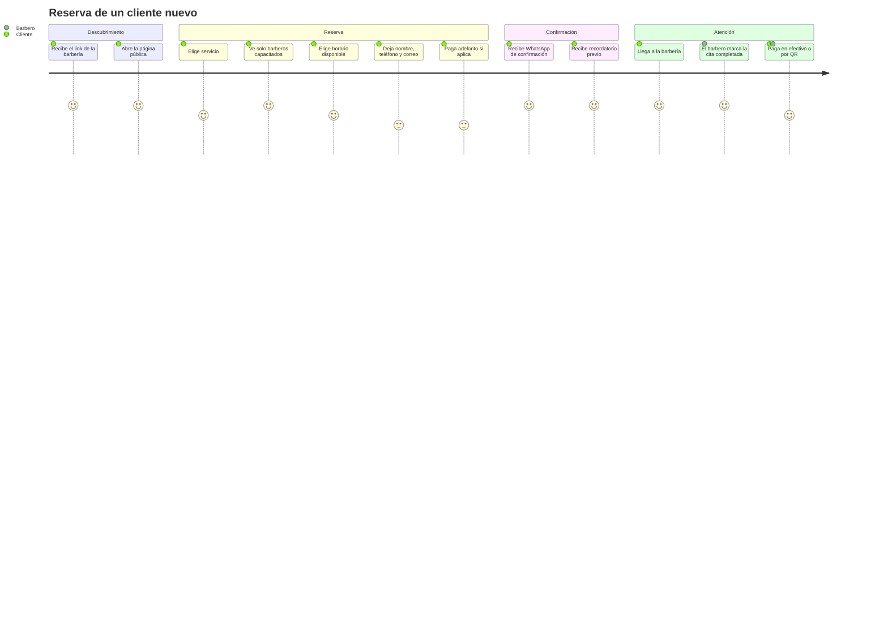

# PRD — Guardao (módulo de barberías)

| | |
|---|---|
| **Estado** | Vigente |
| **Versión** | 1.0 |
| **Fecha** | Agosto 2026 |
| **Alcance** | MVP — módulo de barberías |
| **Documento base** | [`plan-proyecto-guardao.md`](./plan-proyecto-guardao.md) |

---

## 1. Objetivo del producto

Guardao es una plataforma de reservas con pagos integrados para negocios en Colombia. El desarrollo arranca con **barberías**; discotecas y restaurantes se suman después reutilizando el mismo motor de reservas.

**Problema que resuelve.** Hoy la barbería promedio en Colombia agenda por WhatsApp y cuaderno. Eso produce tres pérdidas concretas:

1. **Inasistencias sin costo.** El cliente no llega, nadie lo penaliza, y esa hora del barbero se pierde.
2. **Tiempo del dueño en coordinar.** Cada reserva es una conversación manual.
3. **Doble reserva.** Dos personas quedan a la misma hora con el mismo barbero.

**Propuesta de valor.** Un link propio donde el cliente reserva solo, recordatorios automáticos por WhatsApp que reducen la inasistencia, y cobro en línea que va directo a la cuenta de la barbería.

**Modelo de negocio.** Suscripción mensual de la barbería a Guardao. El dinero que la barbería cobra a sus clientes **no pasa por Guardao**: cada negocio conecta su propia cuenta Wompi. Guardao no es intermediario financiero de esas transacciones.

---

## 2. Usuarios finales

| Usuario | Rol técnico | Qué hace | Qué le importa |
|---|---|---|---|
| **Dueño de barbería** | `OWNER` | Configura sedes, barberos, servicios, horarios y precios. Ve informes. Paga la suscripción. | Que sea fácil de configurar y que se note en menos inasistencias |
| **Barbero** | `STAFF` | Ve su agenda del día, marca citas como completadas o no asistidas, cobra. | Que su agenda sea confiable y que nadie más toque sus citas |
| **Cliente final** | *sin cuenta* | Reserva desde el link público. Confirma que asistirá, cancela o reprograma desde su enlace privado. | Reservar en menos de un minuto, sin registrarse |
| **Equipo Guardao** | `SUPER_ADMIN` | Ve barberías activas, estado de suscripciones y métricas. | Saber cuánto se factura y quién está por caerse |

**Decisión de producto clave: el cliente final no tiene cuenta.** Se le reconoce por número de teléfono. Obligar a registrarse para cortarse el pelo es fricción que cuesta reservas.

---

## 3. Funcionalidades del MVP

### 3.1 Cuentas y estructura
- Registro y login del dueño, con soporte de múltiples sedes por cuenta
- Tres roles: `OWNER`, `STAFF` (con usuario propio vinculado a su registro de barbero), `SUPER_ADMIN`
- Aislamiento estricto entre negocios: ninguna barbería ve datos de otra

### 3.2 Configuración
- CRUD de sedes, barberos y servicios (nombre, precio, duración en pasos de 30 minutos)
- **Habilidades**: qué barbero sabe hacer qué servicio
- Horario general por sede con múltiples franjas por día (jornada partida)
- Horario individual por barbero, más días libres, vacaciones y bloqueos puntuales

### 3.3 Agenda
- Vista día, semana y mes; creación manual de citas
- Estados: pendiente, confirmada, completada, cancelada, no asistió
- **Solo el barbero asignado puede marcar su cita como completada**
- Cada cita guarda copia del precio y la duración al momento de reservar
- Informes: totales, completadas, ingresos por barbero

### 3.4 Página pública de reservas
- Un link por barbería (`/book/:slug`), con selector de sede
- Flujo: servicio → staff capacitado → horario disponible → datos del cliente
- Los horarios ocupados se muestran **deshabilitados, no ocultos**
- Reconoce clientes recurrentes por teléfono
- **Personalización de colores**: 5 paletas predefinidas más una personalizable
- Confirmación de asistencia, cancelación y reprogramación por enlace privado con token, sin login

### 3.5 Notificaciones
- Confirmación, recordatorio, cancelación, reprogramación y pago recibido
- WhatsApp como canal principal, correo como respaldo
- Cuenta única de Guardao compartida por todas las barberías

### 3.6 Pagos
- Cada barbería conecta su propia cuenta Wompi
- Adelanto configurable al reservar
- En la cita: efectivo o transferencia con QR en pantalla
- Suscripción mensual de la barbería a Guardao, recurrente por tokenización

### 3.7 Control de inasistencias
- Contador de citas asistidas e inasistencias
- **3 inasistencias consecutivas → adelanto obligatorio para volver a reservar**
- El recordatorio previo lleva el enlace privado con un botón para **confirmar la asistencia**. Confirmar no cambia la disponibilidad, porque el horario ya estaba ocupado; sirve para que la barbería sepa con quién puede contar y a quién conviene llamar antes de que el puesto se pierda

---

## 4. Fuera del alcance del MVP

Explícitamente **no** entran en la primera versión:

| Fuera de alcance | Cuándo |
|---|---|
| Programa de lealtad por sellos | Etapa 6 |
| Catálogo de productos, carrito y checkout | Etapa 7 |
| Galería sincronizada de Instagram y TikTok | Etapa 7 |
| Programa de referidos | Etapa 8 |
| Panel admin interno de Guardao | Etapa 9 |
| Verticales de discotecas y restaurantes | Post-validación |
| App móvil nativa | Sin fecha |

**Descartado permanentemente:** cualquier chatbot o asistente de IA orientado al cliente final. La sección "Luna IA" de los mockups iniciales se eliminó. El webhook de WhatsApp responde con un texto fijo, sin interpretar el mensaje.

---

## 5. Recorrido del usuario

---

## 6. Métricas de éxito

### 6.1 Métricas de producto

| Métrica | Definición | Meta a 3 meses del lanzamiento |
|---|---|---|
| **Tasa de inasistencia** | `NO_SHOW / total de citas` | Por debajo del 10% |
| **Reservas por autoservicio** | Citas creadas desde la página pública / total | Más del 60% |
| **Tiempo de reserva** | Desde abrir la página hasta confirmar | Menos de 90 segundos |
| **Configuración completada** | Barberías que terminan sedes + staff + servicios + horarios en su primera semana | Más del 80% |
| **Doble reserva** | Citas cruzadas del mismo barbero | **Cero. Sin tolerancia.** |

La tasa de inasistencia es la métrica que justifica el producto: es el dolor que el dueño siente en plata. Si los recordatorios no la mueven, el valor percibido se cae aunque todo lo demás funcione.

### 6.2 Métricas de negocio

| Métrica | Meta a 6 meses |
|---|---|
| Barberías activas de pago | 30 |
| MRR | Definir según precio final |
| Churn mensual | Por debajo del 5% |
| Barberías que llegan por referido | Más del 20% |

### 6.3 Métricas técnicas

| Métrica | Umbral |
|---|---|
| Disponibilidad de la API | 99.5% mensual |
| Latencia p95 del endpoint de disponibilidad | Menos de 500 ms |
| Tasa de entrega de WhatsApp | Más del 95% |
| Errores 5xx | Menos del 0.5% de las peticiones |

---

## 7. Requisitos no funcionales

- **Idioma**: español de Colombia en toda la interfaz y las notificaciones
- **Moneda**: peso colombiano (COP), montos enteros sin decimales
- **Zona horaria**: `America/Bogota`. Las citas se almacenan con zona horaria explícita
- **Móvil primero**: la página pública se consume mayoritariamente desde celular
- **Accesibilidad**: contraste mínimo legible; la personalización de colores advierte cuando lo rompe
- **Datos personales**: se guardan nombre, teléfono y correo de clientes finales. Aplica la Ley 1581 de 2012 (Habeas Data, Colombia) — requiere política de tratamiento de datos antes del lanzamiento público

---

## 8. Riesgos de producto

| Riesgo | Impacto | Mitigación |
|---|---|---|
| La barbería no completa la configuración inicial | Se registra y nunca usa el producto | Asistente guiado paso a paso; medir la métrica de configuración completada |
| Meta demora la aprobación de las plantillas de WhatsApp | Sin recordatorios, se cae la propuesta de valor | Iniciar el trámite ante Meta al comenzar la Etapa 3, no en la 5 |
| El dueño no confía en conectar su cuenta Wompi | Sin pagos, queda solo la agenda | Permitir operar sin pagos; el adelanto es opcional |
| La regla de 3 inasistencias molesta a clientes finales | Quejas hacia la barbería | Configurable por negocio; el dueño decide si la activa |

---

## 9. Criterio de lanzamiento

El MVP se lanza cuando, validado en staging:

- [ ] Una barbería se registra, configura todo y publica su link sin ayuda del equipo
- [ ] Un cliente reserva, recibe WhatsApp y llega a su cita
- [ ] El barbero cobra por QR y ve el pago confirmado
- [ ] Los tests de doble reserva concurrente pasan en verde
- [ ] Los tests de aislamiento entre negocios pasan en verde
- [ ] Los smoke tests post-despliegue pasan en producción
