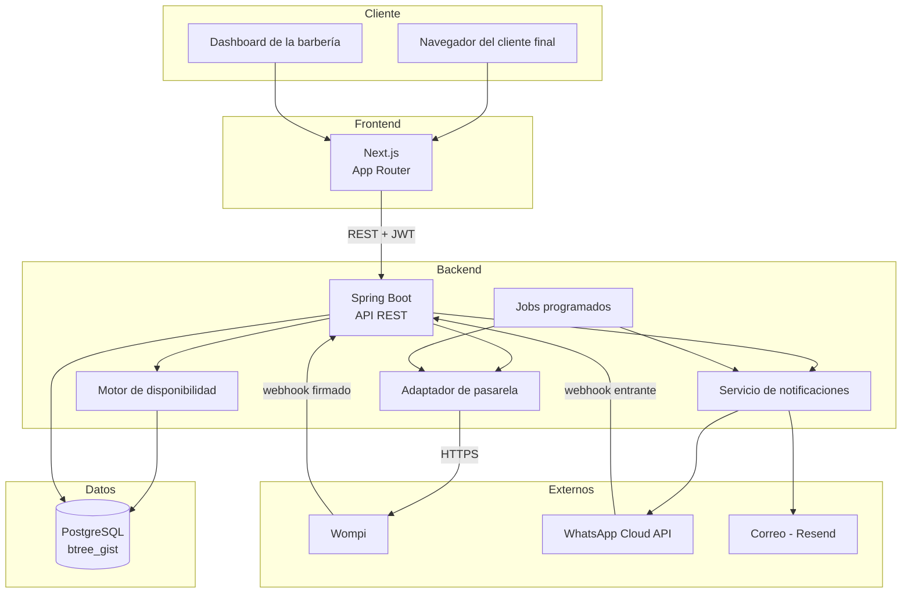

# RFC-001 — Plataforma de reservas multi-tenant con pagos por negocio

| | |
|---|---|
| **Estado** | Aceptado |
| **Autor** | Equipo Guardao |
| **Fecha** | Agosto 2026 |
| **Revisores** | Los 4 desarrolladores del equipo |
| **Documentos relacionados** | [PRD](./prd-guardao.md) · [ADR](./adr/) · [Tech Spec](./tech-spec-guardao.md) |

---

## 1. Resumen

Se propone construir una plataforma SaaS multi-tenant de reservas para barberías en Colombia, con un motor de disponibilidad propio, notificaciones por WhatsApp y pagos donde **cada negocio conecta su propia pasarela**.

Este RFC documenta el problema, la propuesta técnica, las alternativas descartadas y los riesgos asumidos.

---

## 2. El problema

### 2.1 Contexto del negocio

Una barbería colombiana promedio opera con WhatsApp y un cuaderno. Esto genera:

- **Inasistencias sin fricción**: no hay recordatorio ni penalización, y la hora se pierde
- **Doble reserva**: dos clientes agendados con el mismo barbero a la misma hora
- **Tiempo del dueño**: cada reserva requiere una conversación
- **Sin historial**: no sabe quién es cliente frecuente ni quién nunca llega

### 2.2 Los problemas técnicos reales

Traducido a ingeniería, hay tres problemas que definen la arquitectura:

**Problema 1 — Disponibilidad con reglas compuestas.** Calcular si un horario está libre requiere cruzar cuatro fuentes: horario de la sede (con jornadas partidas), horario individual del barbero, sus bloqueos puntuales, y las citas ya agendadas. Encima, la duración no es fija: un corte dura 30 minutos y un tinturado 120. No sirve un modelo de turnos de tamaño uniforme.

**Problema 2 — Doble reserva bajo concurrencia.** Dos clientes pueden abrir la página al mismo tiempo, ver el mismo hueco libre y confirmar con milisegundos de diferencia. Una validación de tipo "consultar y luego insertar" en código de aplicación **tiene una ventana de carrera** y va a fallar en producción. El costo de fallar es alto: dos personas presentándose a la misma hora.

**Problema 3 — Aislamiento multi-tenant.** Todas las barberías comparten base de datos. Una consulta a la que se le olvide filtrar por negocio filtra datos entre clientes. No es un bug de funcionalidad, es una brecha de confidencialidad.

---

## 3. Propuesta técnica

### 3.1 Arquitectura general

Monolito modular en Spring Boot con frontend Next.js separado, sobre PostgreSQL. Sin microservicios.



### 3.2 Decisión central: la base de datos garantiza la no-colisión

La protección contra doble reserva **no vive en el código de aplicación**. Se implementa con una restricción `EXCLUDE` de PostgreSQL sobre rangos de tiempo, usando la extensión `btree_gist`:

```sql
ALTER TABLE appointment ADD CONSTRAINT appointment_no_overlap
  EXCLUDE USING gist (
    staff_id WITH =,
    tstzrange(scheduled_at, scheduled_at + (duration_min || ' minutes')::interval) WITH &&
  ) WHERE (status IN ('PENDING', 'CONFIRMED'));
```

La aplicación **sí** revalida disponibilidad dentro de la transacción antes de insertar — eso da un mensaje de error limpio en el 99% de los casos. Pero la restricción es la que hace la garantía real: si dos transacciones concurrentes intentan el mismo rango, PostgreSQL rechaza una. No hay ventana de carrera posible.

**Esta es la decisión técnica más importante del proyecto.** Todo lo demás es reemplazable.

### 3.3 Snapshot de precio y duración

Cada `APPOINTMENT` copia el `price` y `duration_min` del servicio al momento de reservar. Si la barbería sube precios en marzo, las citas de febrero conservan lo que se cobró. Sin esto, los informes históricos se corrompen cada vez que alguien edita un servicio.

### 3.4 Aislamiento multi-tenant

Un filtro resuelve el `business_id` desde el JWT y lo aplica por defecto a cada consulta, no ticket por ticket. Complementado con tests explícitos de acceso cruzado que fallan en rojo si alguien rompe el aislamiento.

### 3.5 Pagos: adaptador con credenciales por negocio

Interfaz `PaymentGatewayAdapter` (crear transacción, verificar firma, consultar estado) con implementación `WompiAdapter`. Cada negocio guarda sus credenciales cifradas en `GATEWAY`.

Dos flujos de dinero distintos:

| Flujo | Origen | Destino | Credenciales |
|---|---|---|---|
| Servicios y adelantos | Cliente final | Cuenta de la barbería | Las del negocio |
| Suscripción mensual | Barbería | Cuenta de Guardao | Las de Guardao |

---

## 4. Alternativas consideradas

### 4.1 Motor de reservas: construir vs. integrar

| Opción | A favor | En contra | Decisión |
|---|---|---|---|
| **Construir propio** | Control total sobre habilidades, jornadas partidas y duraciones variables | Es el trabajo más delicado del proyecto | **Elegida** |
| Cal.com / integrar | Ahorra semanas iniciales | No modela "qué barbero sabe qué servicio"; adaptar cuesta más que construir | Descartada |
| Google Calendar API | Gratis, conocido | Depende de que cada barbero tenga cuenta Google; sin control transaccional para evitar doble reserva | Descartada |

El motor de disponibilidad **es** el producto. Tercerizarlo significa aceptar el modelo de datos de otro para el problema central del negocio.

### 4.2 Prevención de doble reserva

| Opción | Problema | Decisión |
|---|---|---|
| Validación en código de aplicación | Ventana de carrera entre el `SELECT` y el `INSERT` | Descartada como única defensa |
| Bloqueo pesimista (`SELECT FOR UPDATE`) | Funciona, pero serializa por barbero y complica el código | Descartada |
| Bloqueo optimista con versión | No aplica: el conflicto es entre filas distintas, no sobre la misma fila | Descartada |
| **Restricción `EXCLUDE` de PostgreSQL** | Requiere `btree_gist` y atar el diseño a Postgres | **Elegida** |

El costo real es el acoplamiento a PostgreSQL. Se acepta: no hay plan de migrar de motor, y la garantía que da no la iguala ninguna de las otras.

### 4.3 Modelo de pagos

| Opción | En contra | Decisión |
|---|---|---|
| **Cada negocio conecta su Wompi** | Complica el onboarding | **Elegida** |
| Guardao recibe todo y transfiere | Convierte a Guardao en intermediario financiero: obligaciones regulatorias, riesgo de contracargos, manejo de dinero ajeno | Descartada |
| Solo efectivo, sin pasarela | Elimina el adelanto, que es la palanca contra inasistencias | Descartada |

### 4.4 Arquitectura: monolito vs. microservicios

Monolito modular. Con 4 desarrolladores y cero usuarios, microservicios agregan complejidad operativa (despliegues coordinados, trazas distribuidas, consistencia eventual) sin resolver ningún problema que hoy exista. Los módulos quedan separados por paquete para poder extraer alguno más adelante si el tráfico lo justifica.

### 4.5 Notificaciones: cuenta única vs. cuenta por negocio

Cuenta única de Guardao para WhatsApp. Es lo contrario a la decisión de pagos, y por buena razón:

- Registrar una cuenta de WhatsApp Business ante Meta toma días y requiere verificación de empresa. Pedírselo a cada barbería mata el onboarding.
- Las plantillas se aprueban **una sola vez** en vez de una por negocio.
- El dinero sí es sensible y debe ir directo al dueño; un mensaje de recordatorio no lo es.

---

## 5. Riesgos

| # | Riesgo | Probabilidad | Impacto | Mitigación |
|---|---|---|---|---|
| R1 | **Doble reserva en producción** | Baja | Crítico | Restricción `EXCLUDE` + test de concurrencia obligatorio en CI |
| R2 | **Fuga de datos entre negocios** | Media | Crítico | Filtro por defecto + tests de acceso cruzado + revisión obligatoria en PR |
| R3 | Meta demora o rechaza las plantillas de WhatsApp | Alta | Alto | Iniciar el trámite en Etapa 3; correo como respaldo funcional |
| R4 | Webhook de Wompi duplicado o fuera de orden | Alta | Alto | Idempotencia por identificador de transacción + validación de firma |
| R5 | Credenciales de Wompi comprometidas | Baja | Crítico | Cifrado en reposo, nunca en logs, nunca devueltas por la API |
| R6 | Errores de zona horaria en las citas | Media | Alto | `timestamptz` siempre; nunca fechas sin zona; tests con cambio de día |
| R7 | El VPS se cae y no hay respaldo reciente | Baja | Crítico | Backups diarios automáticos con retención y prueba de restauración |
| R8 | Complejidad del motor de disponibilidad subestimada | Media | Alto | Es lo primero que se construye y lo más testeado; se aborda en Etapa 2 |

### Riesgo R6 en detalle

Colombia no tiene horario de verano, lo que reduce el riesgo — pero no lo elimina. Una cita guardada como fecha sin zona horaria se interpreta distinto según la configuración del servidor. **Regla: toda marca de tiempo es `timestamptz`.** Las horas de apertura y cierre en `SCHEDULE` sí son horas locales sin zona, porque "abrimos a las 8" es relativo a la sede.

---

## 6. Impacto operativo

### 6.1 Infraestructura

- Un VPS (Hetzner o DigitalOcean) de 8 GB de RAM con Coolify
- Dos entornos con bases de datos **separadas**: staging y producción
- Staging protegido por autenticación básica o restricción por IP, con llaves de sandbox de Wompi

### 6.2 Lo que el equipo debe operar

| Componente | Qué puede fallar | Documentado en |
|---|---|---|
| Webhooks de Wompi | Entrega fallida, firma inválida, duplicados | [Runbook](./runbook-guardao.md) |
| WhatsApp | Cuota agotada, plantilla rechazada, token expirado | [Runbook](./runbook-guardao.md) |
| Jobs programados | Recordatorios no enviados, cobros de suscripción no ejecutados | [Runbook](./runbook-guardao.md) |
| Migraciones Flyway | Checksum alterado, migración fallida a medias | [Runbook](./runbook-guardao.md) |

### 6.3 Costo mensual estimado

| Concepto | Costo aproximado |
|---|---|
| VPS 8 GB | 20–30 USD |
| Dominio | 1–2 USD |
| WhatsApp Cloud API | Variable por conversación; las de servicio tienen cuota gratuita mensual |
| Correo (Resend) | Gratis en volumen bajo |
| Almacenamiento S3-compatible | 5 USD (desde Etapa 7) |

Costo fijo bajo. El componente que escala con el uso es WhatsApp: conviene medir mensajes por cita desde el primer día, porque es lo que puede sorprender en la factura al crecer.

---

## 7. Preguntas abiertas

1. **Dominio final**: `guardao.com` o `guardao.co` — pendiente por precio y público objetivo
2. **Precio de la suscripción**: sin definir; condiciona la meta de MRR del PRD
3. **Proveedor de WhatsApp**: Meta Cloud API directo o Twilio como intermediario
4. **Ventana del recordatorio**: ¿24 horas antes, 2 horas antes, o ambos? Afecta el costo por conversación
5. **Política de retención**: cuánto tiempo se conservan datos de clientes finales inactivos, según Habeas Data

---

## 8. Decisión

**Aceptado.** Se procede con la arquitectura descrita. Las decisiones individuales quedan registradas como ADR en [`./adr/`](./adr/).
