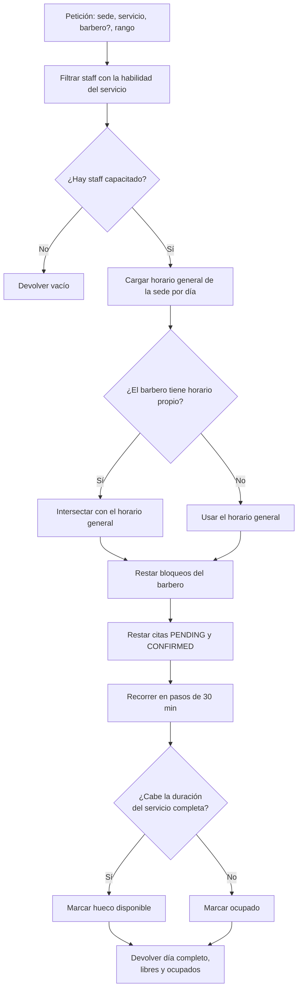
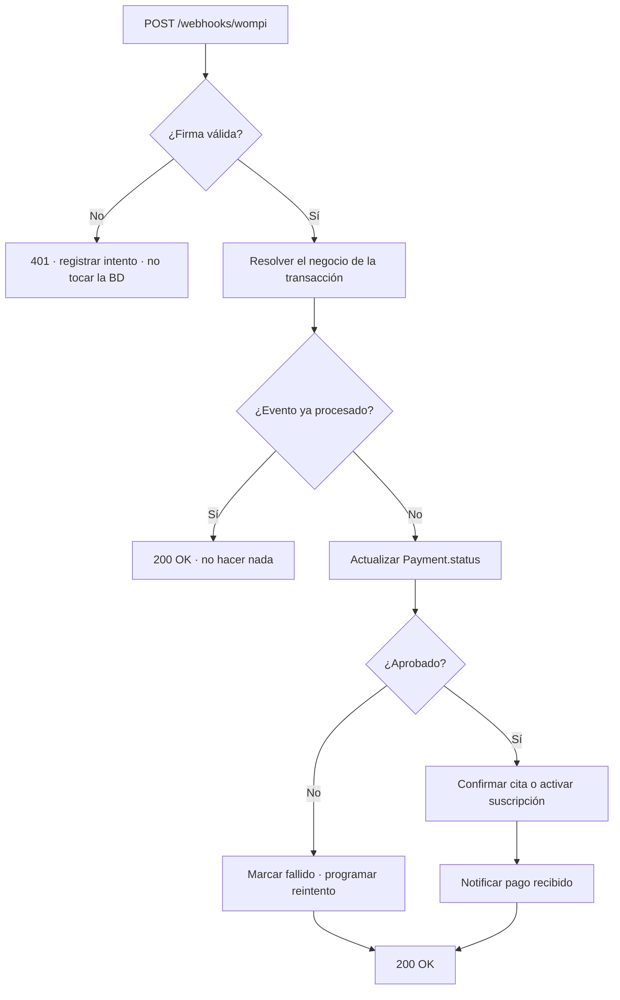

# Tech Spec — Guardao

| | |
|---|---|
| **Estado** | Vigente |
| **Alcance** | MVP (Etapas 0 a 5) |
| **Relacionados** | [RFC-001](./rfc-001-plataforma-reservas.md) · [ADR](./adr/) · [System Design](./system-design-guardao.md) |

Este documento describe **cómo** se construye. El *qué* está en el [PRD](./prd-guardao.md); el *por qué* de cada decisión, en los [ADR](./adr/).

---

## 1. Stack

| Capa | Tecnología | Versión |
|---|---|---|
| Frontend | Next.js (App Router) + React | 16.3 / 19.2 |
| Estilos | Tailwind CSS + shadcn/ui | v4 |
| Backend | Spring Boot sobre Java | 4.1 / 21 |
| Persistencia | Spring Data JPA + Hibernate | — |
| Migraciones | Flyway | — |
| Base de datos | PostgreSQL (extensión `btree_gist`) | 16 |
| Autenticación | Spring Security + JWT | — |
| Documentación de API | springdoc-openapi (OpenAPI 3) | — |
| Pruebas | JUnit 5, Testcontainers, Playwright | — |
| Pagos | Wompi (patrón adaptador) | — |
| Mensajería | WhatsApp Cloud API + Resend | — |
| Infraestructura | VPS + Coolify + Docker | — |

---

## 2. Estructura del código

```
guardao/
├── apps/
│   ├── backend/
│   │   └── src/main/java/com/guardao/backend/
│   │       ├── auth/            JWT, filtro de tenant, roles
│   │       ├── business/        Negocio, sedes, usuarios
│   │       ├── staff/           Barberos, servicios, habilidades
│   │       ├── schedule/        Horarios, bloqueos, disponibilidad
│   │       ├── booking/         Citas, clientes, estados
│   │       ├── payment/         Adaptador, webhooks, suscripciones
│   │       ├── notification/    WhatsApp, correo, plantillas
│   │       └── shared/          Errores, utilidades, configuración
│   │   └── src/main/resources/db/migration/
│   └── frontend/
│       └── app/
│           ├── (dashboard)/     Rutas protegidas
│           ├── book/[slug]/     Página pública de reservas
│           └── cita/[token]/    Gestión por enlace privado
├── docs/
└── docker-compose.yml
```

Cada módulo del backend expone servicios públicos; **ningún módulo accede al repositorio de otro** ([ADR-002](./adr/002-monolito-modular.md)).

---

## 3. Modelo de datos

El esquema completo está en el [plan del proyecto](./plan-proyecto-guardao.md#4-modelo-de-datos). Aquí, lo que importa para implementar.

### 3.1 Reglas transversales

| Regla | Detalle |
|---|---|
| Identificadores | `uuid` en todas las tablas |
| Marcas de tiempo | `timestamptz` siempre. Nunca `timestamp` sin zona |
| Horas de horario | `time` sin zona: "abrimos a las 8" es local a la sede |
| Dinero | Entero en pesos colombianos, sin decimales |
| Multi-tenant | Toda tabla de negocio resuelve a un `business_id` |

### 3.2 Restricciones críticas de base de datos

Estas **no** las genera Hibernate; van escritas a mano en la migración inicial:

```sql
CREATE EXTENSION IF NOT EXISTS btree_gist;

-- Doble reserva: imposible por diseño (ADR-003)
ALTER TABLE appointment ADD CONSTRAINT appointment_no_overlap
  EXCLUDE USING gist (
    staff_id WITH =,
    tstzrange(scheduled_at,
              scheduled_at + (duration_min || ' minutes')::interval) WITH &&
  ) WHERE (status IN ('PENDING', 'CONFIRMED'));

-- Slug único: es la URL pública del negocio
ALTER TABLE business ADD CONSTRAINT business_slug_unique UNIQUE (slug);

-- Un cliente por teléfono dentro de cada negocio (ADR-006)
ALTER TABLE client ADD CONSTRAINT client_phone_per_business UNIQUE (business_id, phone);

-- Token de gestión: único y no enumerable
ALTER TABLE appointment ADD CONSTRAINT appointment_token_unique UNIQUE (manage_token);

-- Stock no negativo (Etapa 7)
ALTER TABLE product ADD CONSTRAINT product_stock_non_negative CHECK (stock >= 0);
```

### 3.3 Índices necesarios

```sql
CREATE INDEX idx_appointment_location_date ON appointment (location_id, scheduled_at);
CREATE INDEX idx_appointment_staff_date    ON appointment (staff_id, scheduled_at);
CREATE INDEX idx_schedule_location_day     ON schedule (location_id, day_of_week);
CREATE INDEX idx_block_staff_range         ON block (staff_id, start_at, end_at);
CREATE INDEX idx_client_business_phone     ON client (business_id, phone);
```

El de `(staff_id, scheduled_at)` es el que sostiene el motor de disponibilidad, que es la consulta más frecuente y más sensible a latencia.

---

## 4. Autenticación y autorización

### 4.1 Contenido del JWT

```json
{
  "sub": "uuid-del-usuario",
  "business_id": "uuid-del-negocio",
  "role": "OWNER | STAFF | SUPER_ADMIN",
  "staff_id": "uuid-del-barbero o null",
  "exp": 1234567890
}
```

**El `business_id` sale siempre del token, nunca de la petición.** Aceptarlo como parámetro sería permitir que cualquiera lea datos de otro negocio ([ADR-004](./adr/004-aislamiento-multi-tenant.md)).

### 4.2 Matriz de permisos

| Acción | OWNER | STAFF | SUPER_ADMIN | Público |
|---|:---:|:---:|:---:|:---:|
| CRUD de sedes, staff, servicios, horarios | ✅ | ❌ | ❌ | ❌ |
| Ver agenda de la sede | ✅ | ✅ | ❌ | ❌ |
| Crear cita manual | ✅ | ✅ | ❌ | ❌ |
| **Marcar cita como completada** | ❌ | Solo la suya | ❌ | ❌ |
| Cancelar / marcar no asistió | ✅ | ✅ | ❌ | ❌ |
| Conectar Wompi, configurar adelanto | ✅ | ❌ | ❌ | ❌ |
| Ver informes | ✅ | ❌ | ❌ | ❌ |
| Métricas de toda la plataforma | ❌ | ❌ | ✅ | ❌ |
| Reservar por la página pública | — | — | — | ✅ |
| Gestionar cita con `manage_token` (confirmar, cancelar, reprogramar) | — | — | — | ✅ |

La regla de "solo el barbero asignado completa su cita" se valida comparando `staff_id` del token contra `staff_id` de la cita. **No basta con ocultar el botón en la interfaz.**

---

## 5. API

Base: `/api/v1`. Respuestas en JSON. Errores con formato uniforme.

### 5.1 Formato de error

```json
{
  "code": "SLOT_NOT_AVAILABLE",
  "message": "Ese horario ya no está disponible",
  "details": { "field": "scheduledAt" },
  "timestamp": "2026-08-17T10:30:00-05:00"
}
```

Códigos propios relevantes:

| Código | HTTP | Cuándo |
|---|---|---|
| `SLOT_NOT_AVAILABLE` | 409 | Violación de `appointment_no_overlap` o revalidación fallida |
| `ADVANCE_PAYMENT_REQUIRED` | 402 | Cliente con 3 inasistencias consecutivas |
| `SLUG_TAKEN` | 409 | Slug de negocio ya usado |
| `NOT_ASSIGNED_STAFF` | 403 | Un barbero intenta completar la cita de otro |
| `INVALID_WEBHOOK_SIGNATURE` | 401 | Firma de Wompi inválida |
| `RATE_LIMITED` | 429 | Exceso de peticiones en endpoint público |

### 5.2 Endpoints autenticados

| Método | Ruta | Rol | Descripción |
|---|---|---|---|
| `POST` | `/auth/register` | — | Crea negocio + sede inicial + usuario OWNER |
| `POST` | `/auth/login` | — | Devuelve JWT |
| `POST` | `/auth/refresh` | — | Renueva el token |
| `GET/POST/PUT/DELETE` | `/locations` | OWNER | CRUD de sedes |
| `GET/POST/PUT/DELETE` | `/staff` | OWNER | CRUD de barberos |
| `POST` | `/staff/{id}/user` | OWNER | Crea el usuario STAFF del barbero |
| `GET/POST/PUT/DELETE` | `/services` | OWNER | CRUD de servicios |
| `PUT` | `/staff/{id}/skills` | OWNER | Asigna habilidades |
| `GET/PUT` | `/locations/{id}/schedule` | OWNER | Horario de la sede |
| `GET/PUT` | `/staff/{id}/schedule` | OWNER | Horario del barbero |
| `GET/POST/DELETE` | `/staff/{id}/blocks` | OWNER | Bloqueos y vacaciones |
| `GET` | `/availability` | OWNER, STAFF | Huecos disponibles |
| `GET` | `/appointments` | OWNER, STAFF | Listado por rango de fechas |
| `POST` | `/appointments` | OWNER, STAFF | Cita manual |
| `PATCH` | `/appointments/{id}/status` | OWNER, STAFF | Cambio de estado |
| `GET` | `/reports` | OWNER | Informes |
| `PUT` | `/business/theme` | OWNER | Tema de la página pública |
| `PUT` | `/business/gateway` | OWNER | Credenciales Wompi (cifradas) |
| `POST` | `/appointments/{id}/charge` | OWNER, STAFF | Genera cobro |
| `GET` | `/subscription` | OWNER | Estado de la suscripción |

### 5.3 Endpoints públicos

Sin autenticación. **Todos con rate limiting.**

| Método | Ruta | Descripción |
|---|---|---|
| `GET` | `/public/{slug}` | Datos del negocio, sedes y tema |
| `GET` | `/public/{slug}/services` | Servicios con su staff capacitado |
| `GET` | `/public/{slug}/availability` | Horarios, marcando los ocupados |
| `POST` | `/public/{slug}/book` | Crea la reserva |
| `GET` | `/public/appointments/{token}` | Detalle por enlace privado |
| `PATCH` | `/public/appointments/{token}` | Cancela o reprograma |

### 5.4 Webhooks entrantes

| Método | Ruta | Origen |
|---|---|---|
| `POST` | `/webhooks/wompi` | Wompi — firma validada antes de procesar |
| `POST` | `/webhooks/whatsapp` | Meta — respuesta fija, sin interpretar el texto |

---

## 6. Motor de disponibilidad

El núcleo del producto. Recibe sede, servicio, opcionalmente un barbero, y un rango de fechas; devuelve los huecos reales.



**Detalles que definen la corrección:**

1. **La duración es la del servicio**, no un turno fijo. Para un servicio de 90 minutos, un hueco de 60 no sirve.
2. **Se devuelven también los ocupados.** La página pública los muestra deshabilitados, no ocultos: el cliente ve el día completo de un vistazo.
3. **El horario del barbero se intersecta** con el de la sede, no lo reemplaza. Un barbero no puede atender con la sede cerrada.
4. **Jornada partida**: varias franjas por día. El algoritmo itera franjas, no un rango único.
5. **Solo bloquean las citas activas.** Canceladas y no asistidas liberan el horario.

---

## 7. Flujo de reserva pública

```mermaid
sequenceDiagram
    participant C as Cliente
    participant F as Next.js
    participant API as Backend
    participant DB as PostgreSQL
    participant W as Wompi
    participant N as WhatsApp

    C->>F: Abre /book/mi-barberia
    F->>API: GET /public/mi-barberia
    API->>DB: Negocio + sedes + tema
    API-->>F: Datos y colores
    F-->>C: Página con la paleta del negocio

    C->>F: Elige servicio
    F->>API: GET /public/{slug}/services
    API-->>F: Staff filtrado por habilidad

    C->>F: Elige barbero y fecha
    F->>API: GET /public/{slug}/availability
    API->>DB: Motor de disponibilidad
    API-->>F: Huecos libres y ocupados

    C->>F: Elige horario y deja sus datos
    F->>API: POST /public/{slug}/book

    rect rgb(40, 40, 50)
        Note over API,DB: Una sola transacción
        API->>DB: Buscar o crear cliente por teléfono
        API->>DB: ¿consecutive_no_shows >= 3?
        alt Requiere adelanto
            API-->>F: 402 ADVANCE_PAYMENT_REQUIRED
            F->>W: Checkout del adelanto
            W-->>F: Pago aprobado
        end
        API->>DB: Revalidar disponibilidad
        API->>DB: INSERT cita + manage_token
        Note over DB: appointment_no_overlap decide
    end

    alt Restricción violada
        DB-->>API: Conflicto de exclusión
        API-->>F: 409 SLOT_NOT_AVAILABLE
        F-->>C: "Ese horario ya no está disponible"
    else Éxito
        DB-->>API: Cita creada
        API-->>F: 201 + enlace de gestión
        API->>N: Confirmación (asíncrona)
        Note over API,N: Si el envío falla,<br/>la reserva sigue confirmada
        F-->>C: Reserva confirmada
    end
```



**Punto crítico:** el envío de la notificación es asíncrono y **nunca bloquea la reserva**. Si WhatsApp está caído, la cita se crea igual y el mensaje se reintenta aparte.

---

## 8. Pagos

### 8.1 Interfaz del adaptador

```java
public interface PaymentGatewayAdapter {
    TransactionResult createTransaction(PaymentRequest request, GatewayCredentials creds);
    boolean verifyWebhookSignature(String payload, String signature, GatewayCredentials creds);
    PaymentStatus getStatus(String externalTransactionId, GatewayCredentials creds);
}
```

Ningún servicio de negocio importa clases de Wompi ([ADR-005](./adr/005-pasarela-por-negocio.md)).

### 8.2 Flujo del webhook



**Idempotencia:** se guarda el identificador de transacción externo con restricción única. Wompi reenvía eventos; procesar dos veces el mismo no debe duplicar nada. Siempre se responde 200 salvo firma inválida — un error 500 hace que Wompi reintente indefinidamente.

### 8.3 Cifrado de credenciales

Las credenciales de `GATEWAY` se cifran con AES-GCM usando una clave maestra en variable de entorno (distinta por entorno). Nunca se registran en logs ni se devuelven por la API, ni siquiera enmascaradas.

---

## 9. Notificaciones

| Evento | Canal | Momento |
|---|---|---|
| Confirmación de reserva | WhatsApp + correo | Inmediato |
| Recordatorio | WhatsApp | Job programado, antes de la cita |
| Cancelación | WhatsApp | Inmediato |
| Reprogramación | WhatsApp | Inmediato |
| Pago recibido | WhatsApp | Al confirmarse el webhook |

**Cuenta única de Guardao**, compartida por todas las barberías. Plantillas aprobadas una sola vez ante Meta, con variables por cita.

Cada envío deja una fila en `NOTIFICATION` con canal, tipo, estado, `provider_message_id` y fecha. Ese `provider_message_id` es lo que permite relacionar una respuesta entrante con su cita.

**El fallo de envío nunca bloquea el flujo principal.** Se marca como fallido y se reintenta desde el job.

---

## 10. Jobs programados

| Job | Frecuencia | Qué hace | Si falla |
|---|---|---|---|
| Recordatorios | Cada 15 min | Busca citas próximas sin recordatorio enviado | Reintenta el siguiente ciclo |
| Reintento de notificaciones | Cada 30 min | Reenvía las marcadas como fallidas (con tope de intentos) | Marca como agotado tras N intentos |
| Cobro de suscripciones | Diario | Cobra las suscripciones con fecha vencida | Marca fallida, reintenta con retroceso |
| Sincronización de redes | Diario | Trae fotos de Instagram y TikTok (Etapa 7) | Registra y continúa |

Los jobs deben ser **idempotentes**: ejecutarlos dos veces no debe duplicar mensajes ni cobros. Se garantiza consultando el estado antes de actuar, no confiando en la frecuencia.

---

## 11. Estrategia de pruebas

| Nivel | Herramienta | Cubre |
|---|---|---|
| Unitarias | JUnit 5 | Motor de disponibilidad, transiciones de estado, cálculos |
| Integración | Testcontainers + PostgreSQL real | Endpoints, migraciones, restricciones |
| Concurrencia | JUnit + hilos | **Doble reserva simultánea** |
| Seguridad | Testcontainers | Aislamiento entre negocios, tokens, rate limiting |
| E2E | Playwright | Flujo completo de registro a cita completada |

**Testcontainers, no base en memoria.** H2 no soporta `btree_gist` ni restricciones `EXCLUDE`; probar contra ella daría falsa confianza justo en lo más importante.

Tres tests que **bloquean el merge** si fallan:

1. Doble reserva concurrente
2. Acceso cruzado entre negocios
3. Flyway levanta el esquema completo desde cero
